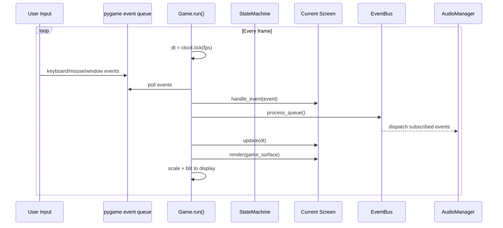
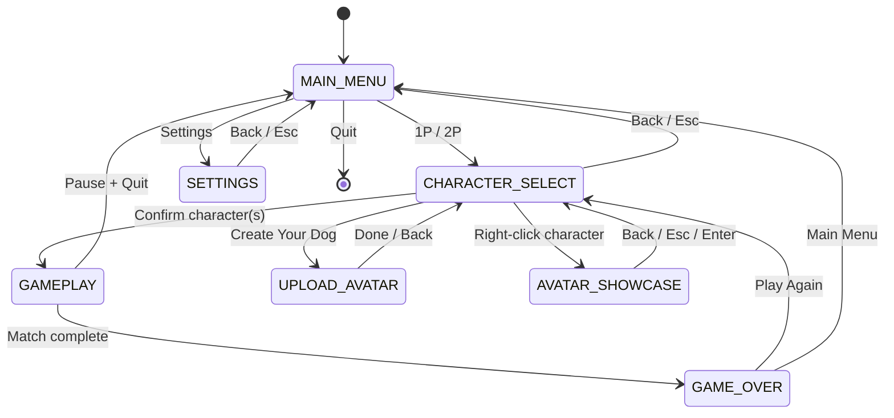
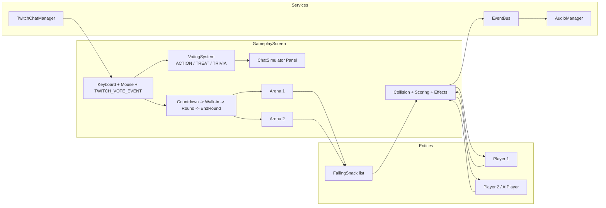
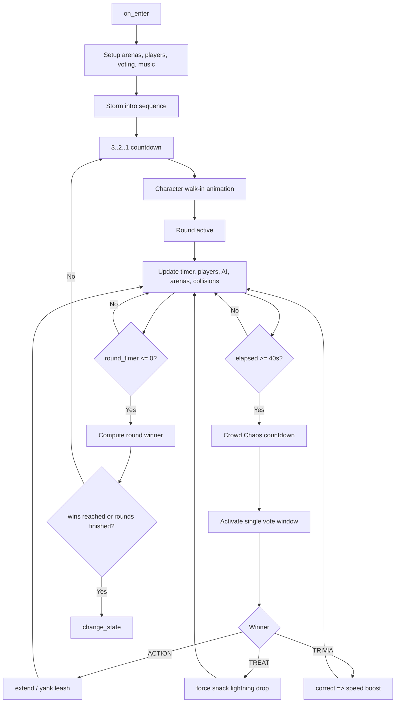
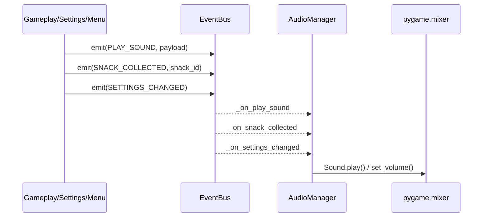
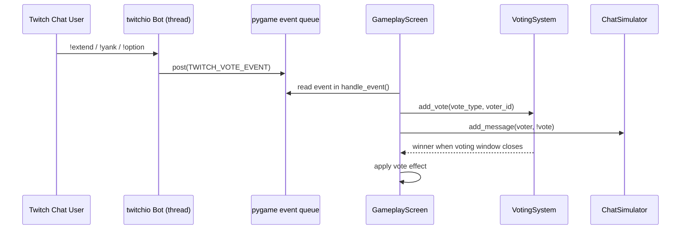
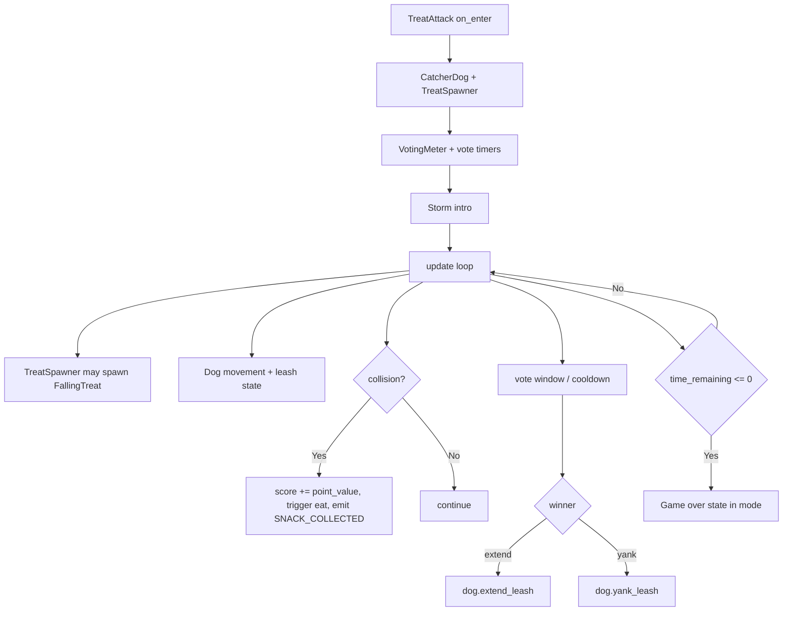
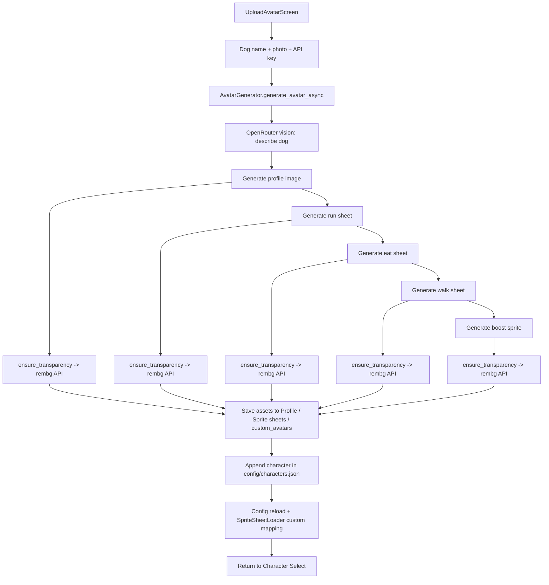
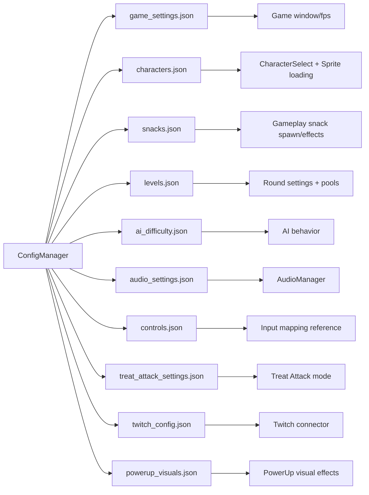

# Jazzy's Treat Storm — System Design

This document summarizes the implemented system architecture and runtime flows of the game.

## 1) High-Level Architecture

```mermaid
flowchart TB
    User[Player / Twitch Chat]

    subgraph App[Game Application - Pygame]
        Main[main.py]
        Game[src/game.py\nGame loop + render scaling]
        SM[src/core/state_machine.py\nStateMachine]
        EB[src/core/event_bus.py\nEventBus]
        CFG[src/core/config_manager.py\nConfigManager]
        Audio[src/audio/audio_manager.py\nAudioManager]
    end

    subgraph Screens[Screens]
        MM[MainMenuScreen]
        CS[CharacterSelectScreen]
        GP[GameplayScreen]
        TA[TreatAttackGameplay]
        ST[SettingsScreen]
        GO[GameOverScreen]
        UA[UploadAvatarScreen]
        AS[AvatarShowcaseScreen]
    end

    subgraph GameplayDomain[Gameplay Domain]
        P1[Player]
        P2[Player / AIPlayer]
        Arena[Arena + FallingSnack]
        Vote[VotingSystem + VotingMeter + ChatSimulator]
        FX[StormIntroSequence + Powerup VFX]
    end

    subgraph Integrations[External Integrations]
        Twitch[Twitch Chat]
        OR[OpenRouter API]
        Rembg[rembg API]
        FS[Assets + JSON Config + .env]
    end

    Main --> Game
    Game --> CFG
    Game --> EB
    Game --> SM
    Game --> Audio
    Audio <-- events --> EB

    SM --> Screens
    MM --> SM
    CS --> SM
    GP --> SM
    TA --> SM
    ST --> SM
    GO --> SM
    UA --> SM
    AS --> SM

    GP --> P1
    GP --> P2
    GP --> Arena
    GP --> Vote
    GP --> FX
    GP --> Twitch

    TA --> Vote
    TA --> FX

    UA --> OR
    UA --> Rembg

    CFG --> FS
    Game --> FS
    GP --> FS
    UA --> FS

    Twitch --> GP
    User --> MM
    User --> CS
    User --> GP
    User --> TA
    User --> UA
```

## 2) Core Runtime Loop

## 3) Screen State Machine

## 4) Gameplay (Split-Screen) Internal Component Diagram

## 5) Gameplay Round & Crowd Chaos Flow

## 6) Event Bus + Audio Event Flow

## 7) Twitch Voting Integration

## 8) Treat Attack Mode Flow

## 9) Avatar Generation Pipeline (Custom Character)

## 10) Configuration Ownership Map

## Notes

- Main orchestration starts in `main.py` and `src/game.py`.
- Cross-system communication is event-driven through `EventBus`.
- Screen navigation is centralized via `StateMachine` and `GameState`.
- Gameplay and Treat Attack share core ideas (collect, score, vote) but use separate entity pipelines.
- Avatar generation is asynchronous and integrates external AI image generation + background removal before hot-registering custom characters.
